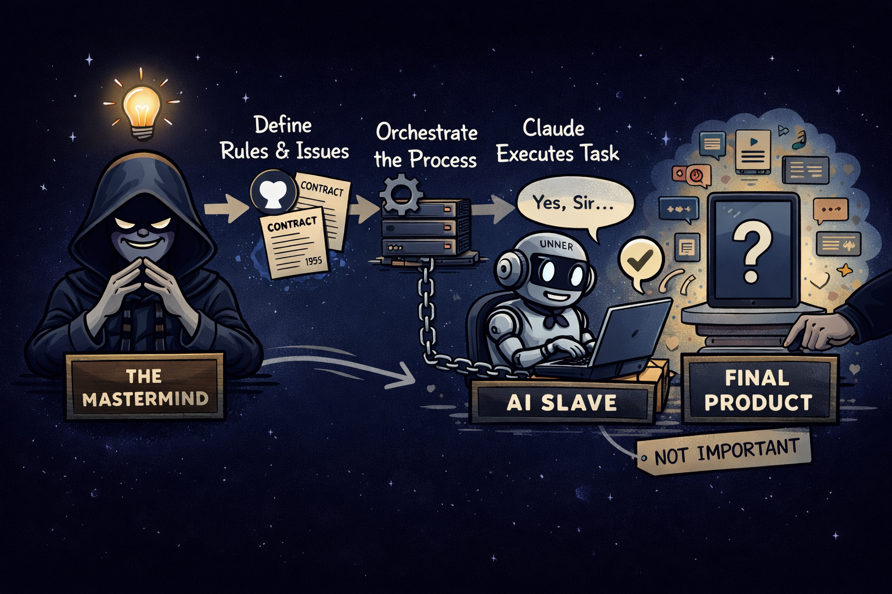
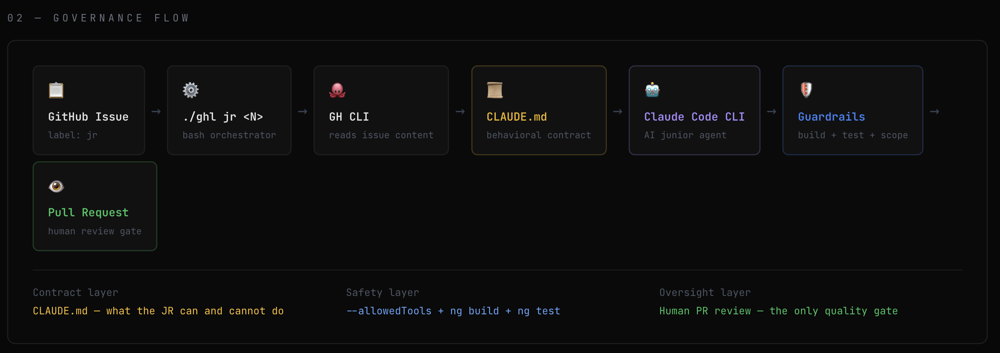

# Agent-Orchestrated Development - JR

## What this project is

This project began as an Angular teaching app.

It evolved into something more valuable:

**A governed development model where an AI agent works like a junior engineer — and a human stays in control of every decision that matters.**

The Angular app is the lab.  
The real product is the workflow.

---

## Core idea

The main question was not:

**How do we build an Angular app?**

It was:

**How do we delegate low-leverage implementation work to an AI agent without losing control, scope, quality, or review?**

This led to a model where:

- GitHub Issues define the contract
- A local bash runner orchestrates execution
- Claude Code acts as the current AI brain
- Repo rules define boundaries
- Human reviews the final PR

---

## Governance model

The project treats the AI as a governed junior developer.

That means:

- the human owns intent,
- the issue defines scope,
- the runner constrains execution,
- the AI implements,
- validation protects quality,
- the human approves the result.

This is not AI replacing engineering.  
It is **AI under process discipline**.

---

## Architecture flow

1. A human creates a GitHub Issue.
2. The issue becomes the work contract.
3. The issue receives the `jr` label.
4. The human runs `./ghl jr <issue-number>`.
5. The runner reads the issue and prepares execution.
6. Claude Code works inside project boundaries.
7. Validation runs.
8. A PR is created against `main`.
9. A human reviews and approves.

---

## Project structure

This project has two layers.

### Control Plane

The Control Plane governs the work.

It includes:

- GitHub Issues as work contracts
- The `jr` label as execution permission
- `ghl` as the local runner/orchestrator
- `CLAUDE.md` as the persistent agent contract
- `.claude/SKILLS.md` as task-specific execution recipes
- validation steps such as build and test
- human PR review

This is where process, limits, and governance live

### Product Plane

The Product Plane is the implementation target.

In this project, it is an Angular 19 app used to teach:

- reactive vs template-driven forms
- dynamic forms and wizards
- custom validators
- form error message best practices

This layer is replaceable.

**The app matters, but it is not the deepest asset of the project.**

---

## Product scope

The Angular app was intentionally narrow.

It exists to teach:

- reactive vs template-driven forms,
- dynamic forms and wizards,
- custom validators,
- form error messages.

Other frontend concerns were intentionally excluded.

---

## Key decisions

### The issue is the contract

The agent does not work from vague chat instructions.  
The GitHub Issue is the source of truth for scope.

### Governance comes before autonomy

The project prioritizes:

- bounded scope
- explicit instructions
- reproducible execution
- human approval

### The AI engine is not the architecture

The first engine was Copilot.  
It failed because of policy restrictions.  
The model survived because the architecture was not tied to one vendor.  
Claude Code replaced Copilot without changing the core workflow.

### Product and orchestration must stay separate

The Angular app is not the same thing as the system that produces it.  
This separation made the project easier to reason about and evolve.

### Manual trigger was the right scope

No listeners, no hidden automation, no background triggers.  
A human starts the run explicitly from the terminal.

---

## Claude Code operating model

Claude Code is the active AI engine. Anthropic describes it as an agentic coding tool that can read the codebase, edit files, run commands, and integrate with development tools.

### `CLAUDE.md`

`CLAUDE.md` is the persistent instruction layer. Anthropic documents it as the project-level file Claude reads at the start of every session to load coding standards, workflows, architecture decisions, and review checklists. It is guidance, not hard enforcement, so instructions should stay specific, concise, and well structured.

In this project, the current `CLAUDE.md` defines:

- the JR role and human supervision,
- working directory and scope,
- prohibited actions,
- Angular 19 forms rules,
- validator patterns,
- checks before PR,
- and a reference to `@.claude/SKILLS.md` for step-by-step recipes.

### `.claude/SKILLS.md`

Anthropic recommends using skills for task-specific instructions that do not need to sit in context all the time. Skills load when invoked explicitly or when Claude determines they are relevant.

In this project, that means:

- `CLAUDE.md` holds the stable contract,
- `SKILLS.md` holds execution recipes,
- and the runner stays thin.

This is a good split because it keeps the permanent contract short while moving operational playbooks out of the always-loaded context.

---

## Security and guardrails

This project treats the AI as a governed junior developer, not an autonomous operator.

### Hard boundaries

The agent is expected to work within strict limits:

- work only inside the Angular application scope,
- do not change dependency files without explicit permission,
- do not modify CI/CD or governance files during execution,
- do not bypass review,
- do not perform GitHub CLI operations.

### Important execution rule

**The AI agent is not allowed to run any `gh` / GitHub CLI command.**

GitHub operations belong to the runner and the human-controlled workflow layer, not to the AI execution layer.

That means:

- the agent does not read or mutate GitHub state directly through CLI,
- the agent does not create PRs,
- the agent does not inspect issues through `gh`,
- the agent does not manage branches, labels, or repository metadata through GitHub CLI.

The runner owns orchestration.  
The human owns approval.  
The AI owns bounded implementation only.

So the practical model here is:

- `CLAUDE.md` tells Claude how to behave,
- the runner constrains the workflow,
- and tool permissions / allowedTools provide the actual execution boundary.

---

## What was validated

This project validated that:

- an issue-driven workflow can control an AI agent,
- a shell runner can orchestrate real development tasks,
- the AI motor can be swapped without losing the model,
- `CLAUDE.md` and `SKILLS.md` can be separated into contract vs recipe,
- the product can stay secondary while the workflow remains the main asset,
- governed delegation is more valuable than ad-hoc prompting.

---

## Current status

### Control Plane

**Status: validated MVP**

The orchestration model is proven:

- issue contract,
- local runner,
- agent rules,
- AI execution,
- PR review.

### Product Plane

**Status: fulfilled for its purpose**

The Angular app achieved its educational role and served as a safe lab.

---

## One-line definition

A governed, local-first agentic development workflow where GitHub defines the contract, a shell runner orchestrates execution, Claude Code acts as the AI brain, `CLAUDE.md` defines persistent rules, `SKILLS.md` defines execution recipes, and a replaceable product layer serves as the implementation laboratory.
